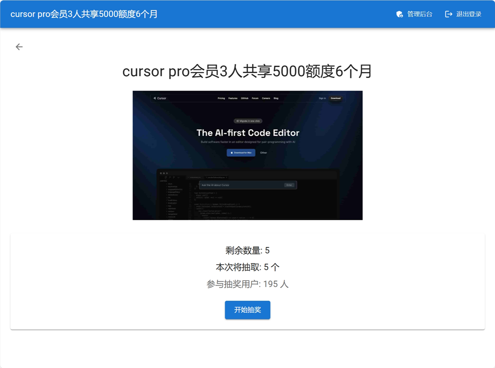
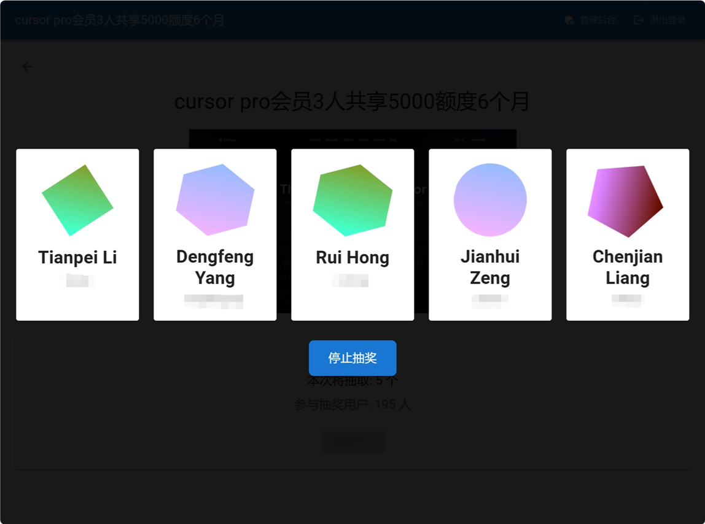
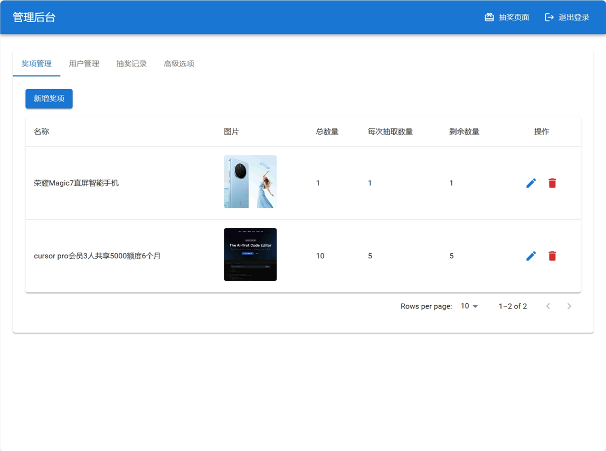

# 抽奖系统

一个功能完整的抽奖系统，支持用户激活、奖品管理、抽奖和记录查询等功能。

## 界面预览

### 抽奖界面



### 管理后台



## 功能特点

### 用户管理
- 支持批量导入用户（CSV格式）
- 用户自助激活（扫码激活）
- 管理员批量激活/取消激活
- 用户搜索和管理
- 用户编辑和删除

### 奖品管理
- 奖品创建和编辑
- 支持奖品图片上传
- 设置奖品数量和每次抽取数量
- 剩余数量自动统计

### 抽奖功能
- 动态抽奖动画效果
- 支持多人同时中奖
- 可配置是否允许重复中奖
- 实时更新奖品库存
- 自动记录抽奖历史

### 系统管理
- 完整的抽奖记录查询
- 系统设置管理
- 管理员密码重置
- 系统数据重置

## 技术栈

### 前端
- React 18
- TypeScript
- Material-UI (MUI)
- React Router
- Axios
- Vite

### 后端
- Node.js
- Express
- TypeScript
- MongoDB
- JWT认证

## 开发环境搭建

1. 克隆项目
```bash
git clone https://github.com/wewei/ems-lottery.git
cd ems-lottery
```

2. 安装依赖

```bash
npm install
```

3. 配置环境变量
```bash
# server/.env
MONGODB_URI=mongodb://localhost:27017/lottery
PORT=3000
```

4. 启动开发服务器
```bash
# 同时启动前后端
npm run dev

# 单独启动前端
npm run client:dev

# 单独启动后端
npm run server:dev
```

## 部署说明
1. 构建项目
```bash
npm run build
```

2. 部署配置
- 确保 MongoDB 服务可用
- 配置正确的环境变量
- 如果使用 IIS 部署，参考 web.config 配置

3. 启动服务

```bash
npm run start
```

## 项目结构
```
lottery-app/
├── client/ # 前端代码
│ ├── src/
│ │ ├── components/ # React组件
│ │ │ ├── admin/ # 管理后台组件
│ │ │ └── ...
│ │ ├── pages/ # 页面组件
│ │ ├── utils/ # 工具函数
│ │ └── main.tsx # 入口文件
│ └── package.json
├── server/ # 后端代码
│ ├── src/
│ │ ├── models/ # 数据模型
│ │ ├── routes/ # API路由
│ │ ├── middleware/ # 中间件
│ │ └── index.ts # 服务器入口
│ └── package.json
└── package.json
```

## API 文档

### 用户相关
- `POST /api/users` - 创建用户
- `GET /api/users` - 获取用户列表
- `PUT /api/users/:id` - 更新用户
- `DELETE /api/users/:id` - 删除用户
- `POST /api/users/activate/:alias` - 激活用户
- `POST /api/users/batch-activate` - 批量激活用户
- `POST /api/users/batch-deactivate` - 批量取消激活
- `POST /api/users/import` - 导入用户
- `POST /api/users/preview-import` - 预览导入结果

### 奖品相关
- `POST /api/prizes` - 创建奖品
- `GET /api/prizes` - 获取奖品列表
- `PUT /api/prizes/:id` - 更新奖品
- `DELETE /api/prizes/:id` - 删除奖品
- `POST /api/prizes/upload` - 上传奖品图片

### 抽奖相关
- `POST /api/lottery/draw/:prizeId` - 进行抽奖
- `GET /api/draw-records` - 获取抽奖记录
- `DELETE /api/draw-records/:id` - 删除抽奖记录

### 系统管理
- `GET /api/settings` - 获取系统设置
- `PUT /api/settings` - 更新系统设置
- `POST /api/settings/reset-system` - 重置系统
- `POST /api/auth/login` - 管理员登录
- `POST /api/auth/reset-password` - 重置管理员密码

## 开发指南

### 前端开发
1. 组件开发遵循 React 函数式组件规范
2. 使用 TypeScript 进行类型检查
3. 使用 Material-UI 组件库保持界面一致性
4. 使用 React Router 进行路由管理
5. 使用 Axios 进行 API 调用

### 后端开发
1. 使用 Express 框架处理 HTTP 请求
2. 使用 Mongoose 操作 MongoDB
3. 使用 JWT 进行身份认证
4. 使用 TypeScript 进行类型检查
5. 遵循 RESTful API 设计规范

## 注意事项

1. 数据安全
- 定期备份 MongoDB 数据
- 妥善保管管理员密码
- 定期更新 JWT 密钥

2. 性能优化
- 合理设置分页大小
- 控制上传文件大小
- 优化数据库查询

3. 开发建议
- 遵循代码规范
- 编写必要的注释
- 做好错误处理
- 保持代码整洁

## License

MIT